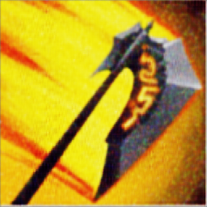
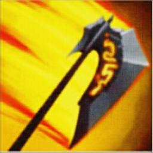

# Remove_random_noise

A project that utilizes CycleGAN to remove random noise from images. 
With the help of this powerful generative model, I are able to produce clean 
and clear images. The repository contains the code and models used to train the 
CycleGAN network. Join us in exploring the potential of GANs for image processing.

# Learning Focus

This project is undertaken with a primary focus on learning. As I delve 
into the intricacies of CycleGAN, 
I aim not only to enhance our understanding of generative models 
but also to refine our skills in image processing and deep learning. 
The codebase serves as a valuable resource for hands-on learning experiences.

### Image Generated with Noise

### Image Generated without Noise

## Cycle-Consistency:

CycleGAN introduces a crucial concept called cycle-consistency to enhance the translation process.

#### Forward Translation:
Given an image from domain A, the generator translates it to domain B.

#### Backward Translation (Cycle):
The generated image from step 1 is taken back to domain A using another generator.

#### Loss Function:
The cycle-consistency loss ensures that the reconstructed image matches the original input.

## Key Advantages:

#### Unpaired Data:
Unlike other methods, CycleGAN can work with unpaired datasets, where corresponding images in different domains are not required during training.

#### Style Transfer:
Enables artistic style transfer, where the characteristics of one image style can be applied to another.

#### Domain Adaptation:
Useful for adapting images from one domain to another, such as day-to-night translation or turning photos into paintings.

CycleGAN has demonstrated success in various image translation tasks, offering a versatile and effective approach to generative modeling.

# Dataset

The images used for training were provided by the author and are not
included in this repository. You can use any images with a typical noise
, such as Gaussian noise, to train the model. The flexibility 
of the dataset allows for experimentation with various noise patterns.
# Contributions

Contributions are welcome! Feel free to open an issue or submit a pull
request. The author intermittently revisits this project for updates. 
Your contributions can help enhance the functionality and performance of 
the image denoising system.
